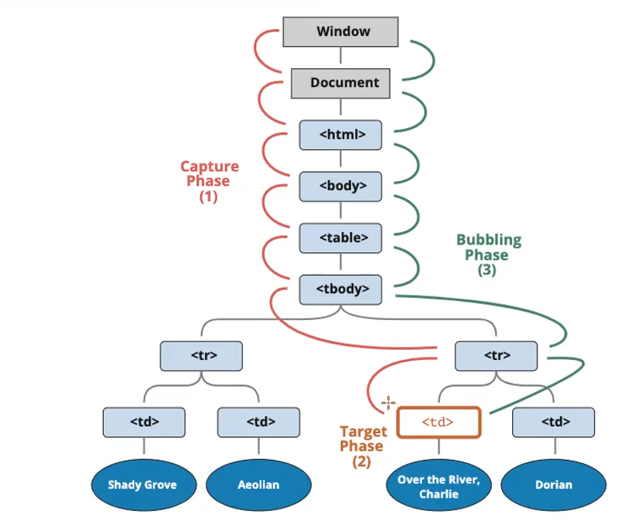
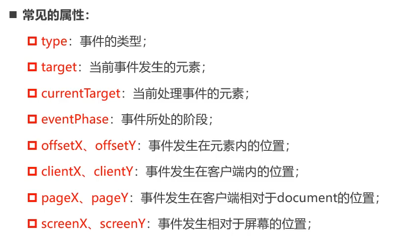
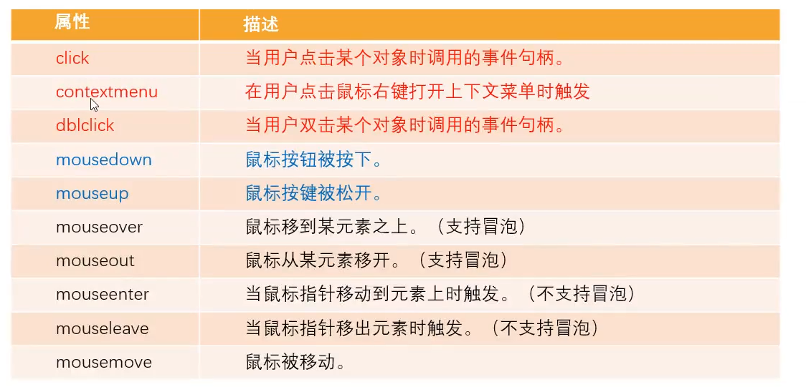
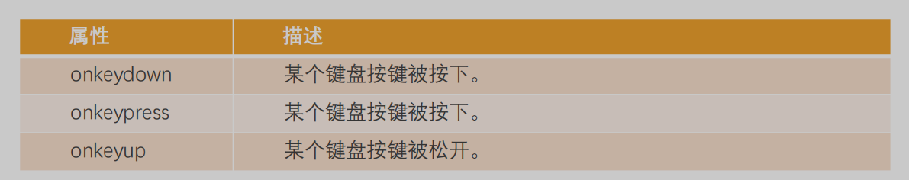
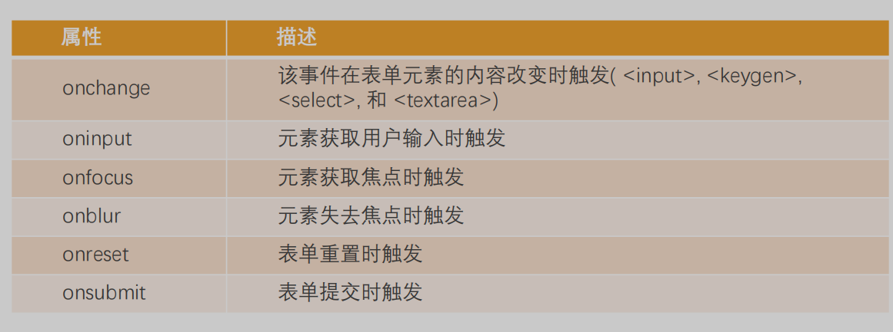

# DOM事件处理

### 认识事件处理

Web页面和用户进行交互，交互的过程捕获叫事件处理

1. 用户**点击某个按钮、用户文本框输入文本、鼠标经过的位置**
2. 浏览器**搭建一条JavaScript和事件之间的桥梁**
3. 当事件发生，JavaScript**可以响应(执行某个函数)，针对事件编写处理程序(handler)**

### 三种事件处理的方案

```jsx
<div>
    <!--第一种方法：直接在HTML中编写JavaScript-->
    <button onclick="console.log('发生了点击') ">按钮1</button>
    <button class="btn2">按钮2</button>
    <button class="btn3">按钮3</button>
</div>
```

```jsx
//第二种方法：添加一个事件监听
//1. 获取元素对象
var btn2El = document.querySelector(".btn2")
var btn3El = document.querySelector(".btn3")

//2. onclick属性
function handleClick2() {
    console.log("按钮二发生了点击")
}
function handleClick3() {
    console.log("按钮二发生了第二次点击")
}
//弊端：此时只有按钮三事件执行了
btn2El.onclick = handleClick2
btn2El.onclick = handleClick3

//第三种方法：添加多个事件监听，同时执行
btn3El.addEventListener("click", function () {
    console.log("btn3第一个的事件监听")
})
btn3El.addEventListener("click", function () {
    console.log("btn3第二个的时间监听")
})
btn3El.addEventListener("click", function () {
    console.log("btn3第三个的事件监听")
})
```

### 常见的事件列表

### 事件流



### 事件冒泡(一般使用)

默认情况下，事件从**最内层的span向外依次传递**，称之为**事件冒泡**(**Event Bubble**)

### 事件捕获

还有一种监听事件流的方式即从**最外层到最内层**(body -> span),称之为**事件捕获(Event Capture)**

```jsx
//1. 获取元素
var spanEl = document.querySelector("span")
var divEl = document.querySelector(".box")
var bodyEl = document.querySelector("body")

//2. 绑定点击事件(从里到外冒泡，称为事件流)
spanEl.onclick = function () {
    console.log("span点击")
}
divEl.onclick = function () {
    console.log("div点击")
}
bodyEl.onclick = function () {
    console.log("body点击")
}

//绑定点击事件: 可以设置希望监听捕获的过程
spanEl.addEventListener("click", function () {
    console.log("span点击，捕获")
}, true)//true表示监听事件捕获
divEl.addEventListener("click", function () {
    console.log("div点击，捕获")
}, true)
bodyEl.addEventListener("click", function () {
    console.log("body点击， 捕获")
}, true)
```

### 事件对象event

### 获取Event对象

```jsx
var btnEl = document.querySelector(".btn")
var divEl = document.querySelector("div")

btnEl.onclick = function (event) {
    console.log("btn点击", event)
}
divEl.onclick = function (event) {
    console.log("div点击", event)
}
```

### Event常见的属性和方法



### target(重点)

**当前时间发生的对象元素**

### currentTarget(重点)

**当前处理事件的对象元素**

### preventDefault

取消事件的默认行为

### stopPropagation

阻止事件的进一步传递

### 事件处理中的this

绑定的是哪个元素，this指向的是哪个元素

### EventTarget使用

### 所有的元素节点继承自EventTarget

### window也继承自EventTarget

### EventTarget是?

- EventTarget是一个**DOM接口，用于添加、删除、派发Event事件**

### EventTarget常见的方法

**addEventListener**：添加某个事件类型及事件处理函数

**removeEventListener**：移除某个事件类型及事件处理函数

**disPatchEventListener**：派发某个事件类型到EventTarget上

```jsx
var btnEl = document.querySelector("button")

var foo = function () {
    console.log("监听按钮点击")
}

btnEl.addEventListener("click", foo)

//5秒后，移除事件监听
setTimeout(function () {
    btnEl.removeEventListener("click", foo)
}, 5000)
```

### 事件委托模式(event delegation)

### 事件委托模式原理

1. 子元素被点击时，通过可以**监听到冒泡子元素的点击**
2. 可以通过**event.target获取到当前监听的元素**

```jsx
var ulEl = document.querySelector("ul")
var activeEl = null
ulEl.onclick = function (event) {
    //1 变量记录的方式
    //如果activeEl存在，则移除active,点击li则移除，点击ul不需要移除
    if (activeEl && event.target !== ulEl) {
        activeEl.classList.remove("active")
    }
    //2.给点击元素添加active
    if (event.target !== ulEl) {
        event.target.classList.add("active")
    }
    //3.记录最新的active对应的li，通过eventTarget获取到当前监听的元素
    activeEl = event.target
}
```

### 事件委托标记

使用data-*进行标记

```jsx
var boxEl = document.querySelector(".box")
boxEl.onclick = function (event) {
    var btnEl = event.target
    var action = btnEl.dataset.action
    switch (action) {
        case "remove":
            console.log("移除")
            break
        case "search":
            console.log("搜索")
            break
        case "add":
            console.log("添加")
            break
        default:
            console.log("点击了其他按钮")
    }
}
```

### 常见的事件

### 常见的鼠标事件



### mouseenter和mouseover的区别

1. mouseleave和mouseenter

不支持冒泡

1. 支持冒泡
- 先调用父元素的mouseout
- 再调用子元素的mouseover
- 因为支持冒泡，所以会将mouseover传递到父元素中

### 常见的键盘事件



### 文档加载事件

DOMContentLoaded:浏览器已经完全加载HTML，构建了DOM树，但和样式表等外部资源为尚未加载完

load:浏览器完加载完了HTML，还加载了所有的外部资源：图片、样式等

### 常见的表单事件

