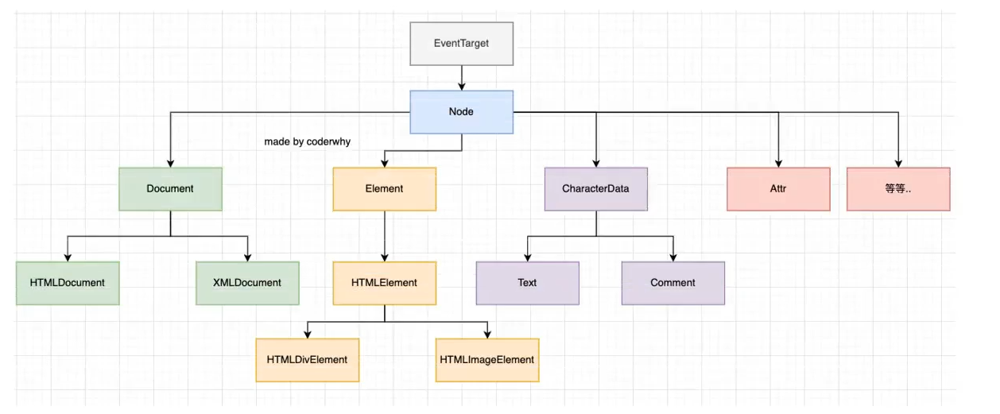
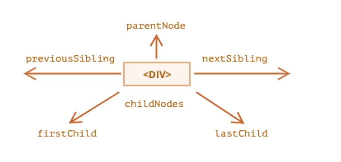
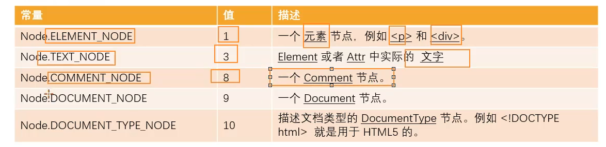
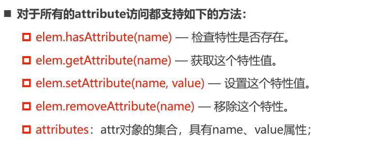
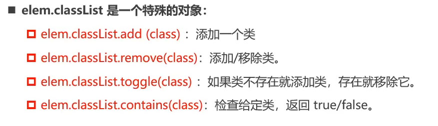
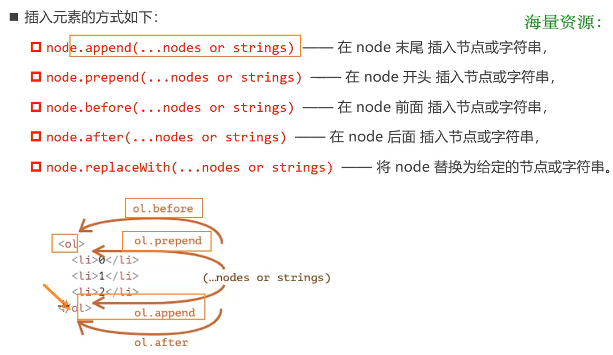
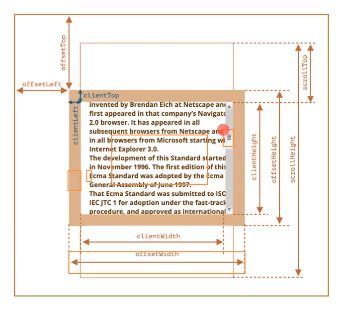

# DOM操作和节点操作

### DOM

- **文档对象模型**
- 简称DOM，将页面所有的内容表示为可以修改的对象
- Window对象包含了DOM及BOM

### 深入理解文档对象模型

- 整个文档被抽象到了document对象中
- 比如document.documentElement对应的是html元素
- 比如document.body对应body元素
- 比如document.head对应的是head元素

### DOM继承关系图

DOM是JavaScript及HTML、CSS之间的桥梁



### DOM元素获取

### DOM获取顶层元素

- html元素: `<html> = documnet.documentElement`
- body元素: `<body> = documnet.body`
- head元素: `<head> = documnet.head`
- 文档声明: `<!DOCTYPE html> = documnet.doctype`

### 节点导航(Node navigator)

- 节点之间存在如下的关系
- 节点表示所有的元素以及文本，获取一个节点后(Node)，可以**根据这个节点获取其他的节点**，称之为节点的导航
1. 父节点：parentNode
2. 前兄弟节点： previousSibling
3. 后兄弟节点：nextSibling
4. 子节点：childrenNodes
5. 第一个子节点：firstChild
6. 第二个子节点：lastChild



### 元素导航(Element navigator)

- 元素即只包含标签，获取到一个元素后，根据这个元素取获取其他的元素，称之为元素之间的导航
- 元素之间存在如下的关系
    1. 父元素：parentElement
    2. 前兄弟节点：previousElementSibling
    3. 后兄弟节点：nextElemnetSibling
    4. 子节点：children
    5. 第一个子节点：firstElementChild
    6. 第二个子节点：lastElementChild
    
    
    

### DOM的两种操作方式(即两种开发模式)

1. 原生DOM操作(JQuery)
2. Vue/React/Angular

```jsx
<template>
    <div:class="">{{MackBook}}</div>
</template>
//先变成虚拟DOM，将虚拟DOM转换成DOM
```

```jsx
//等同于以下代码
var divEl = documnet.creatElement("div")
divElementHTML = "MackBook"
divEl.classList.add("active")
```

### table元素之间的导航

### table元素支持

1. table.rows
2. table.caption/tHead/tFoot
3. table.tBodies

### `<thead>,<tfoot>,<tbody>`提供了rows属性

1. tbody.rows

### `<tr>`支持:

1. tr.cells
2. tr.sectionRowIndex
3. tr.rowIndex

```jsx
//as HTMLTableElement提示
//通过table元素获取内部的后代元素
var tableEl = document.body.firstElementChild
console.log(tableEl.tHead, tableEl.tBodies, tableEl.tHead);

//拿到一行元素
var rowEl = tableEl.rows[2]
console.log(rowEl.cells[0]);
console.log(rowEl.sectionRowIndex);
console.log(rowEl.rowIndex);
```

### form元素之间的导航

### document.forms

获取所有的form元素

### form.elements

获取form元素中的内容

### 设置表单子元素的name获取

```jsx
    //1.获取form
    // var formEl = document.body.firstElementChild
    var formEl = document.forms[0]
    console.log(formEl);

    //2.获取form的子元素
    // var inputEl = formEl.elements[0]
    var inputEl = formEl.elements.account
    //等待五秒中拿到input中的信息
    setTimeout(function () {
      console.log(inputEl.value);
    }, 5000)
```

### 节点的属性(node-type)

### node-Type属性

1. nodeType属性提供了一种获取节点类型的方法
2. 有一个数值类型

### 常见的节点属性



### 节点类型&节点名称

tagName: 仅仅适用于Element节点

nodeName: 对于任意Node定义

1. 对于元素，意义与tagName相同，两个都可以使用
2. 对于其他的节点类型，拥有一个对应节点类型的字符串

```jsx
//打印节点类型
for (var node of bodyChildNodes) {
    if (node.nodeType === Node.COMMENT_NODE) { }
    else if (node.nodeType === 3) { }
    else if (node.nodeType === 1) { }
}
console.log(commentNode.nodeType, textNode.nodeType, boxNode.nodeType)

//打印节点名称
console.log(commentNode.nodeName, textNode.nodeName, boxNode.nodeName)
```

### data

data: **针对非元素的结点获取元素**

### nodeValue

nodeValue: 用于**获取非元素结点的文本内容**

### innerHTML(*)

**innerHTML**: **获取/设置标签内的文本即标签**，"作为HTML"插入

### textContent(*)

**textContent**: **获取/设置标签内的文本**，"作为文本"插入

```jsx
console.log(commentNode.data, textNode.data, boxNode.data)
console.log(boxNode.innerHTML)//元素和标签都获取到
boxNode.innerHTML = "<h3>JavaScript</h2>"
console.log(boxNode.textContent)//拿到/替换文本内容
boxNode.textContent = "<h3>JavaScript</h2>"
```

### 全局属性hidden

```jsx
<button class="btn">点击切换</button>
<div class="title" id="name" style="color: red">
    Hello World!
</div>
```

```jsx
//1.获取元素
titleEl = document.querySelector(".title")
buttonEl = document.querySelector(".btn")
//2.监听btn的点击(回调函数)
buttonEl.onclick = function () {
    titleEl.hidden = true
    titleEl.style.display = "none"
    if (!titleEl.hidden) {
        titleEl.hidden = true
    } else {
        titleEl.hidden = false
    }
}
//简写
buttonEl.onclick = function() {
    titleEl.hidden = !titleEl.hidden
}
```

### 元素的属性和特征

### Attribute的分类

1. HTML标准定的Attribute，称为标准Attribute，如id、class、type，都是标签中的属性
2. 自定义的称为非标准的Attribute，如tab、container、age、height

### Attribute的操作

1. **所有Attribute**都支持的操作



1. 不区分**大小写**
2. **获取到的全部是字符串**(缺点)

`<input type="checkbox">`,这里需要拿到Boolean值

### Property的操作(建议)

1. **对象中的属性称之为property**
2. 标准的**attribute在对应的对象模型中有property**

```jsx
var boxEl = document.querySelector
console.log(boxEl.id)//此处为property
```

1. 对于**非标准的attribute只能通过getAttribute获取**
    
    即**通过".属性"方式获取**，通过**propetty获取attribute的值**
    
    ```jsx
    <div class="tab" id="0101" name="lisi" age="18"></div>
    <input type="checkbox">
    ```
    
    ```jsx
    //获取box元素
    var boxEl = document.querySelector(".box")
    //只能通过标准的attribute获取property
    console.log(boxEl.id, boxEl.age, boxEl.height)
    
    //获取input元素
    var inputEl = document.querySelector("input")
    // if (input.getArribute("checkbox")) {//此处为空的字符串
    //   console.log("input处于选中状态下")
    // }
    //对于一般类型，通过".属性"的方式获取
    if (inputEl.checked) {
        console.log("checkbox处于选中状态下")
    }
    ```
    

### attribute和property相互影响

```jsx
//可以相互修改
boxEl.id = "aaa"
console.log(boxEl.getAttribute("id"))

boxEl.setAttribute("title", "你好！")
console.log(boxEl.title)
```

### input的value设置特殊情况

**input的value只能通过attribute的方法修改**

```jsx
var accountInputEl = document.querySelector(".account")
var btnEl = document.querySelector(".btn")

btnEl.onclick = function () {
    //优先级更高
    accountInputEl.value = "你好！"
    //优先级低
    accountInputEl.setAttribute("value", "Hello!")//一般采用
}
```

### JavaScript动态修改样式

### className

```jsx
//1.className用法
var boxEl = document.querySelector(".box")
boxEl.className = "active"

//2.classList用法
boxEl.classList.add("name")
boxEl.classList.add("abc")
boxEl.classList.remove("abc")

//box在active与name之间切换
var btnEl = document.querySelector(".btn")
btnEl.onclick = function () {
    // if (boxEl.classList.contains("active")) {
    //   boxEl.classList.remove("active")
    // } else {
    //   boxEl.classList.add("acctive")
    // }
    boxEl.classList.toggle("active")
}
```

**classList是可迭代对象，可以通过for..of遍历**

### classList


### style的读取和用法

**用法**

```jsx
boxEl = document.querySelector(".box")
boxEl.style.backgroundColor = "pink"
//1.property使用驼峰样式
console.log(boxEl.style)
//2.如果将一个属性值设置为字符串，那么使用的是默认值
boxEl.style.display = "inline-block"
boxEl.style.fontSize = "40px"
//3.设置多个样式(不建议使用),覆盖内联样式
boxEl.style.cssText = "font-size: 30px;color: blue"
```

**读取**

1. **获取内联样式中的属性，通过style.***
2. **style和css文件中的样式，读取不到**

```
boxEl = document.querySelector(".box")
// 获取内联样式中的属性
console.log(boxEl.style.color)
// 获取外部样式获取不到
console.log(boxEl.style.fontSize)
//getComputedStyle(属性)方法，全局函数
console.log(getComputedStyle(boxEl).fontSize)
```

### dataset的使用(小程序)

```jsx
<div id="abc" data-age="18" data-height="1.88"></div>
```

```jsx
//小程序开发使用
var abcEl = document.querySelector("#abc")
console.log(abcEl.dataset.age)
```

### DOM元素操作

### document.write

1. 便捷，对于**复杂的内容、元素关系的拼接不方便**
2. 目前被保留，不推荐使用

### 插入一个元素步骤(推荐)

1. 创建一个元素
2. 插入元素到DOM某一个位置

```jsx
<span class="first">Hello树先生</span>
<div class="box">
    <span class="second">你好</span>
<p>Hello World!</p>
</div>
```

```jsx
//1.通过innerHTMl，需要解析字符串，所以不推荐
boxEl.innerHTML = `<h2 class="title">这是标题</h2>`
//2. 真实创建一个DOM对象
var h2El = document.createElement("h2")
h2El.className = "title"
h2El.classList.add("active")
h2El.textContent = "标题"

//将h2El插入(推荐使用)
//boxEl.append(h2El)
// boxEl.prepend(h2El)
// boxEl.before(h2El)
// boxEl.after(h2El)
boxEl.replaceWith(h2El)

//插入到span和p元素之间
//获取元素的三种
// var spanEl = document.querySelector("span")
// var spanEl = boxEl.children[0]
// var spanEl = document.querySelector(".second")
var spanEl = boxEl.querySelector(".second")
```



### clone()和remove()

clone()方法可以传入一个Booelan类型的值，决定**是否克隆子元素**

```jsx
 //1.获取元素
var boxEl = document.querySelector(".box")
var removeEl = document.querySelector(".remove-btn")
var cloneEl = document.querySelector(".clone-btn")

//2.监听remove-btn点击事件,移除元素
// removeEl.onclick = function () {
//   boxEl.remove()
// }

//3.克隆元素(有克隆深度)
count = 0
cloneEl.onclick = function () {
    var newNode = boxEl.cloneNode(true)
    newNode.children[0].textContent = "这也是标题" + count
    // boxEl.after(newNode)
    document.body.append(newNode)
    count++
}
```

### clientWidth()

contentWidth + padding(不包含滚动条)

### clientHeight()

contentHeight + padding

### offsetWidth



### window滚动事件

### window的width和height

1. innerWidth、innerHeight：获取window窗口的宽度和高度(包括滚动条)
2. outerWidth、outerHeight：获取window窗口整个宽度和高度(包括调试栏、工具栏)
3. documentElement.clientHeight、documentElement.clientWidth：获取HTML的宽度和高度(不包含滚动条)

### window的滚动位置

1. scrollY：X轴滚动的位置(pageXoffset)
2. scrollX：Y轴滚动的位置(pageYoffset)

```jsx
//获取window滚动的区域
window.onclick = function () {
    console.log(window.scrollY)
}

var scrollBtnEl = document.querySelector(".scrollBtn")
scrollBtnEl.hidden = true
window.onscroll = function () {
    var scrollY = window.scrollY
    if (scrollY > 800) {
        // scrollBtnEl.style.display = "block"
        scrollBtnEl.hidden = false
    } else {
        // scrollBtnEl.style.display = "none"
        scrollBtnEl.hidden = true
    }
}

//点击按钮滚动到某个位置
var count = 0
scrollBtnEl.onclick = function () {
    window.scrollBy(0, 100)//在原来基础上增加100
    window.scrollTo(0, 400)
}
```