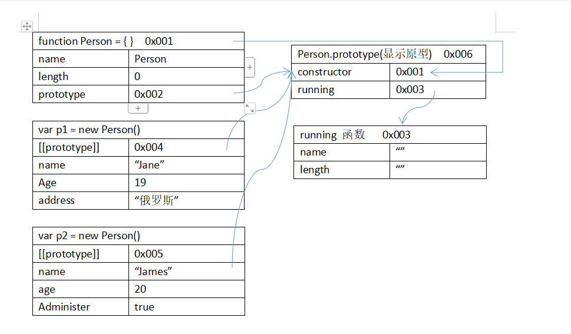
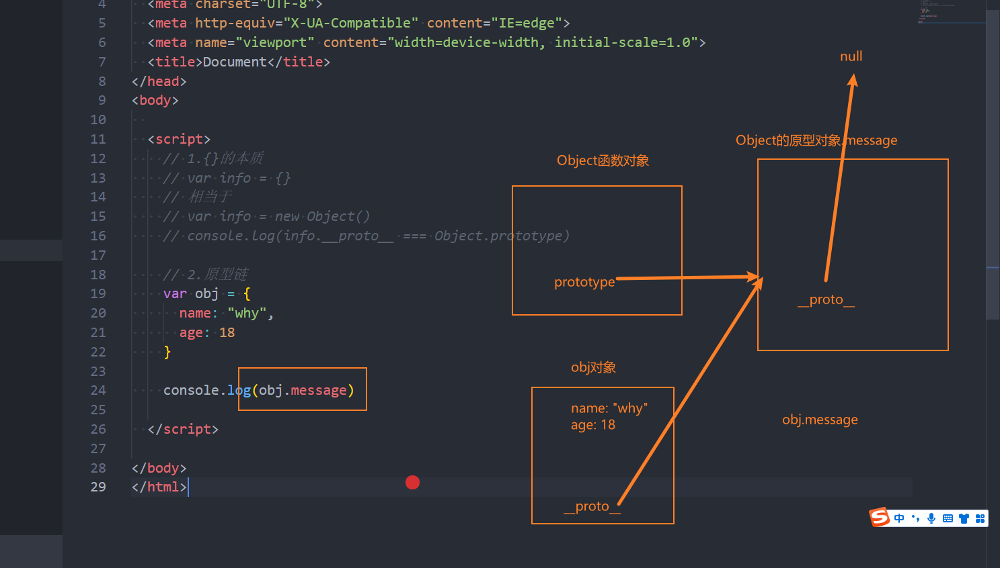
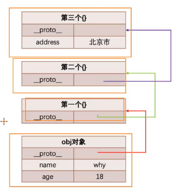
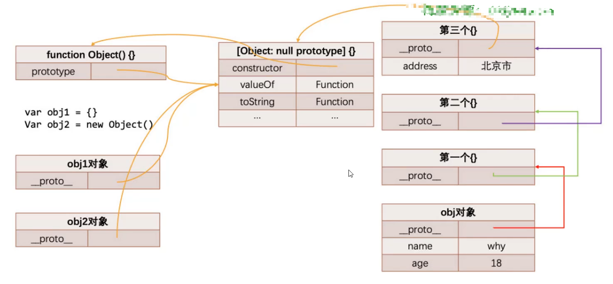
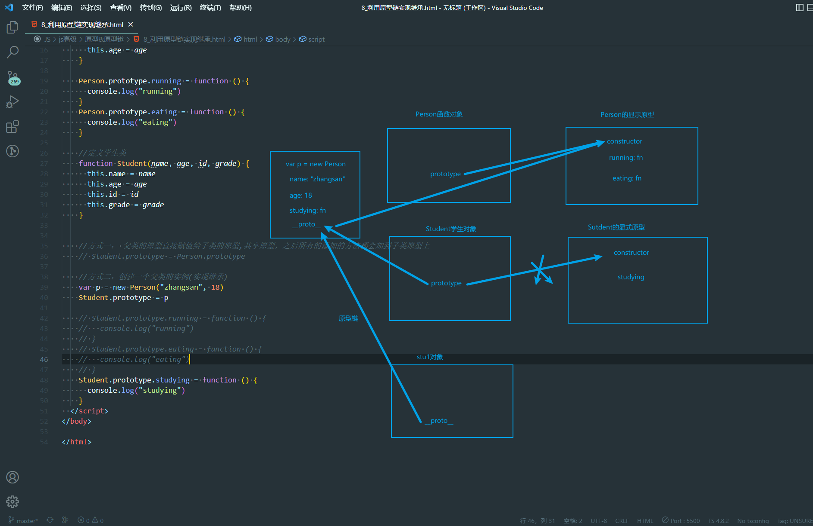
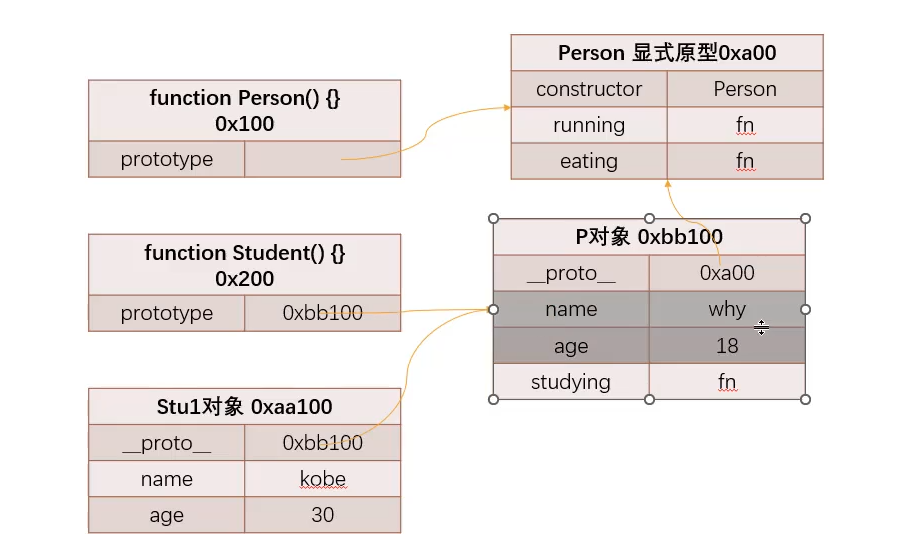
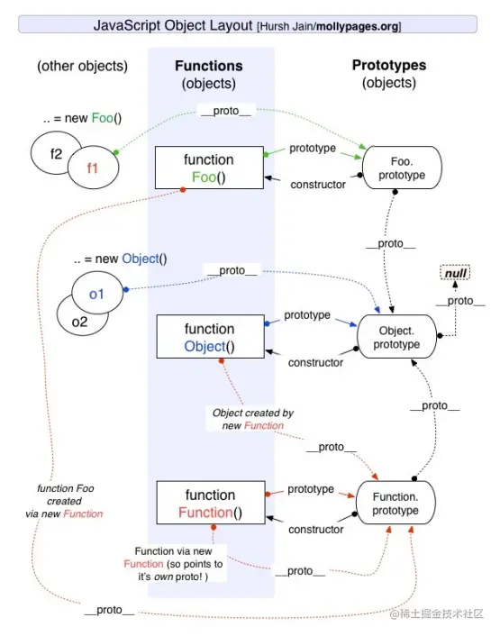

# ES5继承

## ES5

### *原型*

### 对象的原型&函数的原型

### 显示原型

1.将函数看做一个普通的对象时，具备**proto**(隐式原型)

2.将函数看成一个函数时，具备prototype(显示原型)

```jsx
var obj = {
    name: "lisi",
    age: 20
}

console.log(obj)
console.log(obj.__proto__)
obj.__proto__.height = 1.99
console.log(obj.height)
```

### 隐式原型

```jsx
var obj = {}
function foo() { }
//1.将函数看做一个普通的对象时，具备__proto__(隐式原型)
console.log(obj.__proto__)
console.log(foo.__proto__)

//2.将函数看成一个函数时，具备prototype(显示原型)
//作用：用了构造对象时，给对象设置隐式原型
console.log(foo.prototype)
```

### 再解析new操作符

1. 创建空对象var person = new Person() => `var obj = {}`
2. 将这个空对象赋值给this => `this = obj`
3. 将函数的显示原型赋值给函数的隐式原型
    
    `obj._proto_ = Peroson.prototype`
    
4. 执行函数体
5. 返回默认的对象

```jsx
function Foo() {
    obj = {
        name: "zhangsan",
        age: 18,
        sno: 1111
    }
}

var f1 = new Foo()
var f2 = new Foo()
var f3 = new Foo()
console.log(f1.__proto__ === Foo.prototype)
console.log(f1.__proto__)
console.log(Foo.prototype)
```

### 方法赋值在原型上

```jsx
function Person(name, age, id) {
    this.name = name
    this.age = age
    this.id = id

    //一、之前的做法
    // this.running = function () {
    //   console.log(this.name + "running")
    // }
    // this.eating = function () {
    //   console.log(this.name + "eating")
    // }
}

//二、方法赋值在原型上的做法
//多个对象有相同的值时，可以将它放到构造函数的对象的显式原型上
//由构造函数创建出来的对象，会共享这些属性
Person.prototype.running = function () {
    console.log(this.name + " running")
}
Person.prototype.eating = function () {
    console.log(this.name + " eating")
}

//创建三个Person对象
var p1 = new Person("zhangsan", 18, 1001)
var p2 = new Person("lisi", 19, 1002)
var p3 = new Person("wangwu", 20, 1003)
console.log(p1)
//1.p1的隐式原型是 Person.prototype
//2.p1.running上的方法:
//   自身上查找
//   去原型上查找
p1.running()
p2.eating()
```

### 创建对象的内存机制



### 显示原型中的属性

```jsx
//constructor又指向了Person函数对象
function Person() {
}

//1. 对constructor在prototype上的验证
var PersonPrototype = Person.prototype
console.log(PersonPrototype.constructor)
console.log(Person.prototype.constructor === Person)

console.log(Person.name)//Person
console.log(PersonPrototype.constructor.name)//Person

//实例对象p获取constructor属性
var p = new Person()
console.log(p.__proto__.constructor)
console.log(p.__proto__.constructor.name)
```

### 重写函数对象原型

```jsx
function Person() {}
console.log(Person.prototype)

// Person.prototype.message = "Hellw World!"
// Person.prototype.adress = "China"
// Person.prototype.running() = function () { }
// Person.prototype.eating() = function () { }
// //默认情况下，constructor()不会出现在Person.prototype,说明constructor是不可枚举属性
// console.log(Object.keys(Person.prototype))

//直接在原型上赋值
Person.prototype = {
    message: "Hello World!",
    adress: "China",
    running: function () { console.log("running") },
    eating: function () { },
    // constructor: Person
}s

//直接原型上操作constructor变成了可枚举类型
// console.log(Object.keys(Person.prototype))

//因此改为如下的操作
Object.defineProperty(Person.prototype, "constructor", {
    //数据属性描述符默认为flase
    confugurable: true,
    writable: true,
    emumertable: false,
    value: Person
})
console.log(Object.getOwnPropertyDescriptor(Person.prototype, "constructor"))

console.log(Object.keys(Person.prototype))
var p1 = new Person()
p1.running()
```

### 继承

### 默认对象的原型链



### 自定义原型链

```jsx
var obj = {
    name: "zhangsan",
    age: 19
}
obj.__proto__ = { }
obj.__proto__.__proto__ = { }
obj.__proto__.__proto__.__proto__ = { adress: "北京市"}
//最后的__proto__会指向Object的显示原型Object.prototype
```

### 原型链关系的内存图





### 原型链最顶层的原型对象是Object的原型对象

### 利用原型链实现继承

```jsx
//定义Person()类
function Person(name, age) {
    this.name = name
    this.age = age
}

Person.prototype.running = function () {
    console.log("running")
}
Person.prototype.eating = function () {
    console.log("eating")
}

//定义学生类
function Student(name, age, id, grade) {
    //如果删除，打印的是父类构造函数中的实例
    this.name = name
    this.age = age
    this.id = id
    this.grade = grade
}

//方式一： 父类的原型直接赋值给子类的原型,共享原型，之后所有的添加的方法都会加到子类原型上
//缺点：父类和子类共同有一个原型对象，修改了一个，另一个也被修改
// Student.prototype = Person.prototype

//方式二：创建一个父类的实例(实现继承)，用这个实例作为子类的原型对象
//var p = new Person("zhangsan", 18)
//Student.prototype = p
Student.prototype = new Person("zhangsan", 18)

// Student.prototype.running = function () {
//   console.log("running")
// }
// Student.prototype.eating = function () {
//   console.log("eating")
// }
Student.prototype.studying = function () {
    console.log("studying")
}

var stu1 = new Student("wangwu", 25, 1001, 100)
stu1.studying()
console.log(stu1.name)
```



### 弊端

- **某些属性保存在p对象上**
1. 第一：通过直接打印对象**看不到这个属性**（看不到父类的属性）
2. 第二：这个属性会被**多个对象共享**，如果这个**对象是一个引用类型**，会造成问题
3. 第三：不能给Person传递参数(让每个stu有自己的属性)，因为这个对象是一次性创建(无法定制)

### 借用构造函数属性继承

借用构造函数继承(实现了属性的继承)

constructor stealing又名经典继承或伪造对象

```jsx
//定义Person()类
function Person(name, age, id, grade) {
    //这里的this全部指向stu1对象
    this.name = name
    this.age = age
    this.id = id
    this.grade = grade
}

Person.prototype.running = function () {
    console.log("running")
}
Person.prototype.eating = function () {
    console.log("eating")
}

//定义学生类
function Student(name, age, id, grade, adress, height) {
    //借用构造函数，this: stu对象  this.name = name
    Person.call(this, name, age, id, grade)

    this.id = adress
    this.grade = height
}
var stu1 = new Student("zhangsan", 18, 1001, "江西", 1.98)
//创建空对象->将this赋值给空对象->显式原型赋值给__proto__
```

- 在子类的构造函数的内部调用父类构造函数
1. 函数可以在任意时刻被调用
2. 可以通过apply()和call()函数在新创建的对象上执行构造函数

### 弊端

- **父类构造函数至少被调用两次**
1. 一次是创建子类原型时
2. 一次是子类构造函数内部（每次创建子类实例的时候）
- 所有的子类实例事实上会有两份父类的属性
1. 一份在当前的实例自己里面(Person本身)，另一份在子类对应的原型对象中(person_ *proto* _)
2. 不用担心访问的时候出现问题，默认访问的是实例本身这一部分

### 组合继承的原型链关系图



### 创建原型对象的方法

```jsx
//寄生组合式继承
//ES5最终方案:真实开发进行封装工具函数
//创建对象过程， 同下面的Object.create函数作用
function createObject(o) {
	function F() { }
	F.prototype = o
	return new F()
}

//将Subtype和Supertpe联系在一起，叫寄生函数
function inherit(Subtype, Supertype) {
// 以Supertype.prototype作为原型，创建一个新对象，赋值给Subtype.prototype显示原型
Subtype.prototype = Object.create(Supertype.prototype)
// 在Subtype.prototype定义constructor属性，把Subtype的值赋值给constructor属性
Object.defineProperty(Subtype.prototype, "constructor", {
		enumerable: false,
		configurable: true,
		writable: true,
		value: Subtype
	})
}

function Person() { }
function Student() { }

inherit(Student, Person)

//1. 之前的做法
// var p = new Person()
// Student.prototype = p

//2. 方案一
// var obj = {}
// // obj.__proto__ = Person.prototype
// Object.setPrototypeOf(obj, Person, prototype)

//3.方案二：对象之间的原型式继承(Douglas Crockford),区别于原型链继承
function F() { }
F.prototype = Person.prototype
Student.prototype = new F()

//4.方案三
//Object.create():创建一个新对象，让新对象的隐式原型指向传入的Person.prototype
var obj = Object.create(Person.prototype)
console.log(obj.__proto__ === Person.prototype)

Student.prototype = obj
```

### 寄生组合式继承

```jsx
function Person(name, age, height) {
    this.name = name
    this.age = age
    this.height = height
}

//Person()原型上添加方法
Person.prototype.running = function () {
    console.log("running")
}
Person.prototype.eating = function () {
    console.log("eating")
}

//借用构造函数的属性继承
function Student(name, age, height, grade, id) {
    //this的显式绑定
    Person.call(this, name, age, height)
    this.grade = grade
    this.id = id
}
//调用方法继承工具函数
inherit(Student, Person)
Student.prototype.studying = function () {
    console.log("studying")
}

//创建实例对象
var stu1 = new Student("zhangsan", 18, 1.88, 90, 1001)
var stu2 = new Student("lisi", 20, 1.9, 80, 1002)
console.log(stu1, stu2)

stu1.studying()
stu1.running()
stu2.eating()
```

### Object是所有类的父类

### 其他对象方法

### **hasOwnPrototype()**

对象**是否有一个属于自己的属性**

### **in/for in操作符**

**判断某个属性是否在某个对象或者对象原型上**

遍历**不仅是自己对象上的内容，包括原型对象上的内容(除了不可遍历的内容)**

### **instanceof** (一般使用)

用于检测**构造函数(Person、Student类)的prototype，是否出现在某个实例对象的原型链上**

### isPrototypeOf(使用较少)

用于**检测某个对象**，是否出现在**某个实例对象的原型链**上,也可以判断构造函数是否出现在实例对象的原型链上

### 原型关系继承图



1. p1是Person的实例对象
2. object是Object的实例对象
3. Function/Object/Foo都是Function的实例对象
4. 原型对象默认创建时，隐式原型都是指向Object的显式原型(Object指向null)
- Object是Person/Function的父类, Function是Object对象的构造函数

### 构造函数的类方法和实例方法

- 在原型上添加的方法称为实例方法
- 在对象本身上添加的方法是类方法

```jsx
function Person(name, age) {
    this.name = name
    this.age = age
}

//在原型上添加方法称之为实例方法
Person.prototype.running = function () {
    console.log("running")
}
Person.prototype.eating = function () {
    console.log("eating")
}

//在Person本身上添加称之为类方法
var names = ["zhangsan", "lisi", "wangwu", "zhaoliu"]
Person.randomPerson = function () {
    var randomName = names[Math.floor(Math.random() * names.length)]
    return new Person(randomName, Math.floor(Math.random() * 100))
}

var p = Person.randomPerson()
console.log(p)
```