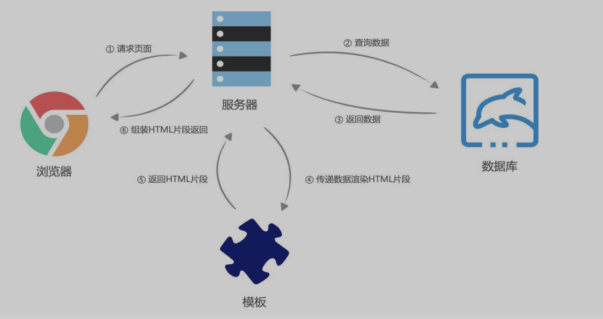

# JavaScript网络编程

### 服务器端渲染



### 前后端分离


### HTTP

### 什么是HTTP

- 超文本传输协议（英语：HyperText Transfer Protocol，缩写：HTTP）是一种用于分布式、协作式和超媒体信息系统的应用层协议；
- HTTP是万维网的数据通信的基础，设计HTTP最初的目的是为了提供一种发布和接收HTML页面的方法；
- 通过HTTP或者HTTPS协议请求的资源由统一资源标识符（Uniform Resource Identifiers，URI）来标识

### HTTP是客户端与服务端的Request和Response的标准

- 通过使用**网页浏览器、网络爬虫**或者其它的工具，客户端发起一个**HTTP**请求到服务器上指定端口（默认端口为80）

✓ 我们称这个客户端为**用户代理程序（user agent）**

- **响应的服务器上存储着一些资源**，比如HTML文件和图像

✓ 我们称这个**响应服务器为源服务器（origin server）**

### HTTP的组成(Request和Response)

### Request

请求头: Request headers

请求体: Request body

请求行

### Response

响应行

响应头: Response headers

响应体: 具体返回的数据


### HTTP的协议版本

- 目前主要使用1.1版本

### HTTP的请求方式

 GET：GET 方法请求一个指定资源的表示形式，使用 **GET 的请求应该只被用于获取数据**。

 HEAD：HEAD 方法请求一个与 GET 请求的响应相同的响应，但没有响应体。

✓ 比如在准备下载一个文件前，先获取文件的大小，再决定是否进行下载；

 **POST**：POST 方法用于将实体提交到指定的资源。

 PUT：PUT 方法用请求有效载荷（payload）替换目标资源的所有当前表示；

 DELETE：DELETE 方法删除指定的资源；

 PATCH：PATCH 方法用于对资源应部分修改；

 CONNECT：CONNECT 方法建立一个到目标资源标识的服务器的隧道，通常用在代理服务器，网页开发很少用到。

 TRACE：TRACE 方法沿着到目标资源的路径执行一个消息环回测试。

### 请求标头(Request Header)

### content-type

 **application/x-www-form-urlencoded**：表示数据被编码成以 '&' 分隔的键 - 值对，同时以 '=' 分隔键和值

 **application/json**：表示是一个json类型；

 **text/plain**：表示是文本类型；

 **application/xml**：表示是xml类型；

 **multipart/form-data**：表示是上传文件；

### content-length

- 自动计算

### keep-alive

 http是基于TCP协议的，但是通常在进行一次请求和响应结束后会立刻中断；

 在http1.0中，如果想要继续保持连接：

✓ 浏览器需要在请求头中添加 connection: keep-alive；

✓ 服务器需要在响应头中添加 connection:keey-alive；

✓ 当客户端再次放请求时，就会使用同一个连接，直接一方中断连接；

 在http1.1中，所有连接默认是 connection: keep-alive的；

✓ 不同的Web服务器会有不同的保持 keep-alive的时间；

✓ Node中默认是5s中；

### accept-encoding

- 告知服务器客户端支持文件压缩格式，JS文件使用gzip编码，对应.gz文件

### accept

- 告知服务器，客户端可接收的文件格式类型

### user-agent

- 客户端相关的信息

### HTTP响应状态码

- 200：客户端请求成功
- 201： POST请求，创建新的资源
- 301：请求资源的URL已经修改，响应中会给出新的URL
- 400：服务端的错误，服务端无法或不进行处理
- 401：未授权的错误处，必须携带请求的身份信息
- 403：客户端没有权限访问，被拒接
- 404：服务器找不到请求的资源
- 500：服务器遇到了不知道怎么处理 的情况
- 503：服务器不可用，可能处于维护或者重载状态

### XHR和Fetch

```jsx
//1. 创建XMLHttpRequest对象
    const xhr = new XMLHttpRequest()
    //2.监听状态的改变
    xhr.onreadystatechange = function () {//该函数加入到宏任务中
      // console.log(xhr.response)
      console.log(xhr.readyState)
      //如果不是DONE状态，等数据拿到之后执行后续操作
      if (xhr.readyState !== XMLHttpRequest.DONE) return
      const jsonObj = JSON.parse(xhr.response)
      console.log(jsonObj)
    }
    //3.配置请求open，第三个参数为async，异步请求为true，false为同步
    xhr.open("get", "http://123.207.32.32:8000/home/multidata")
    //method: 请求的方式(get/post/delete/put/patch...)
    //4.发送请求
    xhr.send()
```

### XMLHttpRequest其他事件监听

 loadstart：请求开始。

 progress： 一个响应数据包到达，此时整个 response body 都在 response 中。

 abort：调用 xhr.abort() 取消了请求。

 error：发生连接错误，例如，域错误。不会发生诸如 404 这类的 HTTP 错误。

 load：请求成功完成。

 timeout：由于请求超时而取消了该请求（仅发生在设置了 timeout 的情况下）。

 loadend：在 load，error，timeout 或 abort 之后触发

```jsx
const xhr = new XMLHttpRequest()
xhr.onload = function() {
    console.log("onload")
}
xhr.open("get", "http://123.207.32.32:8000/home/multidata")
xhr.send()
```

### 响应数据和响应类型获取

```jsx
const xhr = new XMLHttpRequest()
xhr.onreadystatechange = function () {
    if (xht.readyState !== XMLHttpRequest.DONE) return
    //const jsonObj = JSON.parse(xhr.response)//默认为JSON类型
    console.log(xhr.response)//输出为json类型
}
//默认设置xhr的类型为text,可以改为json，则JSON.parse()操作不需要
xhr.responseType = "json"
//open()中可以设置xml、json、text等类型的接口，同时responseType需要设置对应的类型
xhr.open("get", "http://123.207.32.32:8000/home/multidata")

xhr.send()
```

### 监听XHR的状态码


```jsx
const xhr = new XMLHttpRequest()
xhr.onload = function () {
    // console.log(xhr.status, xhr.statusText)
    //根据状态码进行监听
    if (xhr.status >= 200 && xhr.status < 300) {
        console.log(xhr.response)
    } else {
        console.log(xhr.status, xhr.statusText)
    }
}
xhr.open("get", "http://123.207.32.32:8000/home/")
xhr.send()
```

### GET/POST请求传递参数

- 一、GET请求的query参数
- 二、POST请求 x-www-form-urlencoded 格式
- 三、POST请求 FormData 格式
- 四、POST请求 JSON 格式

```jsx
//http: http的get请求
//123.207.32.32: 主机地址
//:8000: 端口号
//home/multidata: 路径
const xhr = XMLHttpRequest()
xhr.onload = function () {
    console.log(xhr.response)
}
//配置请求
xhr.resposeType = "json"
//1.给服务器传递参数的方式一
//xhr.open("get", "http://123.207.32.32:1888/02_param/get?name=zhangsan&age=17&adress=hangzhou")
//2.给服务器传递参数方式二
xhr.open("post", "http://123.207.32.32:1888/02_param/posturl")
//设置Content-Type
xhr.setRequestHeader("Content-Type", "application/x-www-form-urlencoded")
//发送请求
xhr.send("name=zhangsan&age=17&adress=hangzhou")
```

### ajax网络请求封装(可优化)

```jsx
//封装AJAX请求函数
function myAjax({
    url,
    data,
    method,
    data: { },
    success,
    failure
} = {}) {
    //1.创建对象
    const xhr = new XMLHttpRequest()
    //2.监听数据
    xhr.onload = function () {
        //如果状态码大于等于200且小于300，请求成功
        if (xhr.status >= 200 && xhr < 300) {
            //success如果有值则回调
            success && success(xhr.response)
        } else {
            failure && failure({ status: xhr.status, message: xhr.statusText })
        }
    }
    //3.设置类型
    xhr.responseType = "json"
    //4.open方法
    if (message.toUpperCase() === "GET") {
        let resString = []
        for (const item in data) {
            resString.push(item)
        }
        url = url + "?" + resString.join("&")
        xhr.open(method, url)
        //5.send方法
        xhr.send()
    } else {
        xhr.open(method, url)
        //5.send方法
        xhr.setRequestHeader("Content-type", "application/json")
        xhr.send(JSON.stringify(data))
    }
}

//调用函数，在调用者返回结果，发送get请求
myAjax({
    url: "http://123.207.32.32:8000/home/multidata",
    method: "GET",
    data: {
        name: "zhangsan",
        age: 18
    },
    success: function (res) {
        console.log("res: ", res)
    },
    failure: function (err) {
        alert(err.message)
    }
})

//发送post请求
// myAjax({
//   url: "http://123.207.32.32:18888/02_param/postjson",
//   method: "post",
//   data: {
//     name: "zhangsan",
//     age: 18
//   },
//   success: function (res) {
//     console.log("res: ", res)
//   },
/   failure: function (err) {
//     alert(err.message)
//   }
// })
```

### XHR的timeout

```jsx
const xhr = new XMLHttpRequest()
xhr.onload = function () {
    if (xhr.status >= 200 && xhr.status < 300) {
        console.log(xhr.response)
    }
}
xhr.timeout = 1000//表示1s后未执行，系统自动取消本次执行，可手动取消
xhr.open("get", "http://123.207.32.32:18888/02_param/timeout")
xhr.send()
```

### Fetch和相关API

```jsx
//1
// fetch("http://123.207.32.32:8000/home/multidata").then(res => {
//   console.log("res", res)
//   const response = res
//   response.json().then(res => {
//     console.log("res", res)
//   })
// }).catch(err => {
//   console.log("err", err)
// })

//2.
fetch("http://123.207.32.32:8000/home/multidata").then(res => {
    const response = res
    return response.json()
}).then(res => {
    console.log("res", res)
}).catch(err => {
    console.log("err", err)
})

//3.
async function getData() {
    const response = await fetch("http://123.207.32.32:8000/home/multidata")
    const res = await response.json()
    console.log("res:", res)
}
getData()
```

### post文件上传