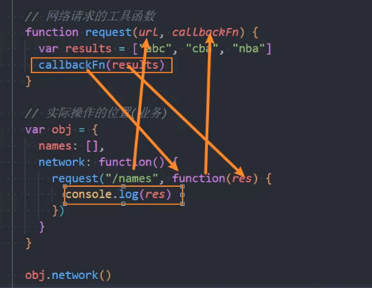

# this绑定规则&箭头函数

### *this的四种绑定规则*

### this是函数的一种隐式参数

不由函数的**定义位置**决定

不由函数的**调用位置**决定

由函数的**调用方式**确定

this**在运行时那一刻被绑定**的

### 默认绑定(直接调用)

- 当直接调用时，this是全局作用域对象，即window
- 处于严格模式下，this指向undefined

```jsx
//例一
function foo () {
    console.log("直接调用，指向的是window", this)
}
function foo()
//严格模式下
"use strict"
foo () {
    console.log("严格模式下，指向undefined", this)
}
foo()
//例二
var obj =  {
    name: "lisi",
    foo: function() {
        console.log("bar:", this)
    }
}
var baz = obj.foo() //this指向obj对象
function test(fn) {
    foo()
}
test(obj.baz) //独立函数调用
```

### 隐式绑定(由对象的方法调用)

- 有一个前提
    1. 必须在**调用的对象内部有一个对函数的引用**(如一个属性上)
    2. 如果没有这样的引用，在进行调用时，会报找不到该函数的的错误
    3. 通过这个引用，间接的将this绑定到这个对象上
- 对象.foo()指向的是这个对象，此时不管foo来源于obj还是obj的原型上，this是所属对象

```jsx
//例一
var obj =  {
    name: "lisi",
    foo: function() {
        console.log("bar:", this)
    }
}
obj.foo() //this指向obj对象
//例二
function foo() {
    console.log("foo函数：", this)
}
var obj = {
    bar: foo
}
obj.bar()//隐式绑定
```

### new绑定(构造函数调用)

new foo()，this指向新的空对象，this为指定的值

```jsx
/*
* 1.没有显示的创建对象
* 2.属性和方法直接赋值给this
* 3.执行函数体中的代码
* 4.没有显示的返回非空对象，默认返回这个对象
*/
function bar() {
    console.log("bar函数：", this)
}
new bar()//this指向空对象
```

### 显式绑定(call()&apply())

foo.call()/foo.apply()调用，this为指向的值

```jsx
//在运行时那一刻被绑定，类似于形参实参
foo.call("abc")//指向String {"abc"}对象

//例一
var obj = {
    name: "lisi"
}
function foo() {
    console.log("foo函数：", this)
}
//隐式的绑定
obj.foo = foo
obj.foo()
//显示的绑定
foo.call(obj)//强制绑定this指向obj
foo.call('abc')//任意的指定绑定的值
foo.call(123)//Number{ 123 },创建对应的包装类型
foo.call(undefined)//如果没有对应的包装类型，默认指向window
foo.apply(obj)
```

### 显式绑定call()和apply()的区别

```jsx
function foo(name, age, height) {
    console.log("foo函数被调用：", this)
    console.log("打印参数：", name, age, height)
}
//第一个参数，绑定this
//第二个参数，以数组的形式传入额外的实参
foo.apply("apply", ["lisi", 20, 1.98])

//第一个参数，绑定this
//第二个参数，后续的参数以多参数的形式传递，作为实参
foo.call("call", "James", 40, 2.05)
```

### bind()绑定函数

如果希望一个函数总是显示的绑定到一个对象上，使用bind函数

- 使用bind()方法，bind()函数创建一个新的**绑定函数**(bound function, BF)
- 绑定函数是一个**exotic function object**(怪异函数对象，ECMAScript 2015中的术语)
- 在bind()被调用时，这个新函数的this被指定为bind()的第一个参数，其余参数作为新函数的参数，供调用时使用

### 第三方库和内置函数的this

```jsx
//内置函数，第三方库，可以根据经验判断
//1.  定时器
setTimeout(function () {
    console.log("定时器函数this的指向：", this)//指向window
}, 1000)

//2. 按钮的监听点击
var btnEl = document.querySelector(".btn")
btnEl.onclick = function () {
    console.log("btn的点击:", this)//this指向btnEl元素
}

btnEl.addEventListener("click", function () {
    console.log("btn的点击:", this)
})

//3. forEach()
var ages = [12, 34, 56]
ages.forEach(function (items) {
    console.log("forEach", this)
}, "aaa")//this绑定的是 "aaa"
```

### this绑定的优先级

1. **默认规则的优先级最低**
2. **bind()绑定优先级大于隐式**的绑定
3. **显示的绑定优先级大于隐式**的绑定
4. **构造函数的绑定优先级大于隐式**的绑定
5. **new不可以和call()/apply()**一起使用
6. **构造函数的绑定高于bind()绑定(bind()**使用较少)
7. **bind()绑定的优先级高于apply()**的优先级

### summary

bind() > apply() > 隐式

new > bind() > 隐式

```jsx
//1.显式的绑定优先级大于隐式的绑定
function foo() {
    console.log("foo", this)
}
var obj = {
    foo: foo
}
obj.foo.apply("zhangsan")

//2.bind高于默认的绑定
var baz = foo.bind("aaa")
var obj = {
    name: "lisi",
    baz: baz
}
obj.baz()

//3.new绑定的优先级高于隐式绑定
var obj = {
    name: "zhangsan",
    foo: function () {
        console.log("foo", this)
    }
}
new obj.foo()//默认创建一个空对象

//4. new的优先级高于bind()
function foo() {
    console.log("foo:", this)
}
var bindFn = foo.bind("bbb")
new bindFn()

//bind()绑定高于apply()的绑定
function bar() {
    console.log("foo:", this)
}
var bindFn = foo.bind("Hello")
bindFn.apply("你好~")
```

### *箭头函数*

### 箭头函数语法

- 箭头函数**不会绑定this**
- 箭头函数**不能作为构造函数使用**(和new一起使用会抛出错误)

### 箭头函数的优化

1. 箭头函数如果只有一个参数，则可以省略()
2. 如果函数体中只有一行代码，{}括号可以省略,不能有return
3. 如果函数体只有一个返回对象，**需要给对象加上()**
4. 只有一行代码时，这行代码的表达式结果会作为函数的返回值默认返回

```jsx
setTimeout(() => {
    console.log("箭头函数")
}, 3000);

//1. 箭头函数如果只有一个参数，则可以省略()
var names = ["zhangsan", "lisi", "wangwu"]
names.forEach(item => {
    console.log(item)
})
//2. 如果函数体中只有一行代码，{}括号可以省略,不能有return
names.forEach(item => console.log(item))
console.log("*****")
//3. 如果函数体只有一个返回对象，需要给对象加上()
var arrFn1 = () => ["abc"]
var arrFn2 = () => ({ name: "张飞" })//小括号是执行体，大括号表示对象的括号
console.log(arrFn1())
console.log(arrFn2())

//4. 只有一行代码时，这行代码的表达式结果会作为函数的返回值默认返回
var NewName = names.filter(item => item === "lisi")
console.log(NewName)

//例: 箭头函数实现nums所有的偶数平方的和filter map reduce
var nums = [10, 11, 20, 13, 30]
var res = nums.filter(item => item % 2 === 0)
.map(item => item * item)
.reduce((preValue, item) => preValue + item)
console.log(res)
```

### 箭头函数的this使用

### 箭头函数中没有this

```jsx
var foo = () => {
    console.log("foo:", this)
}
foo()//指向window
foo.apply()//指向window
```

### this的查找规则

```jsx
var obj = {//对象的大括号不形成作用域
    var foo = () => {
        var baz = () => {
            console.log("baz:", this)
        }
        return baz
    }
}
var fn = obj.foo()
foo.apply("aaa")
```

### 箭头函数this的应用

```jsx
//网络请求的工具函数(独立文件中)
function request(url, callbackFn) {
    var res = ["abc", "lbg", "jdg"]
    callbackFn(res)
}

//实际操作的位置(业务)
var obj = {
    names: [],
    network: function () {
        //1.早期的用法
        // var _this = this
        // request("/names", function(res) {
        //   _this.names = [].concat(res)
        // })

        //2. 箭头函数的写法
        request("/names", (res) => {
            this.name = [].concat(res)
        })
    }
}

obj.network()
console.log(obj)
```

### 请求工具函数

