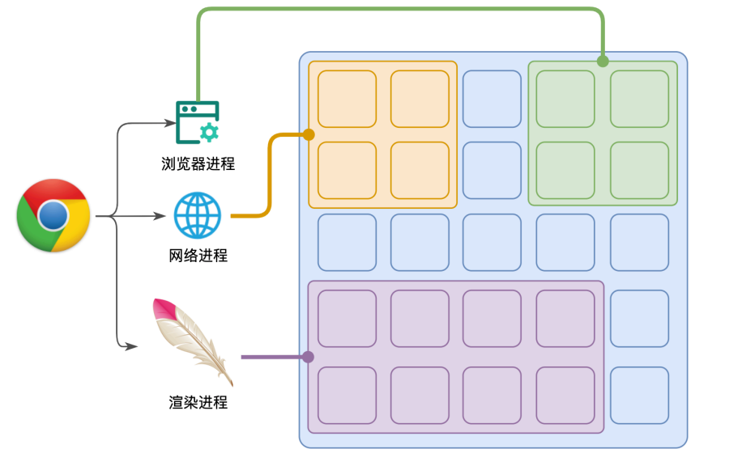
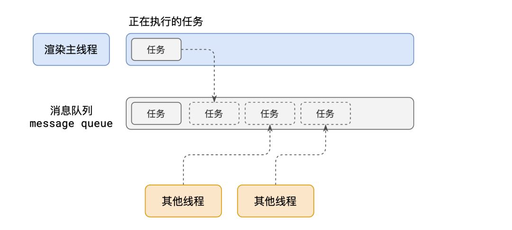
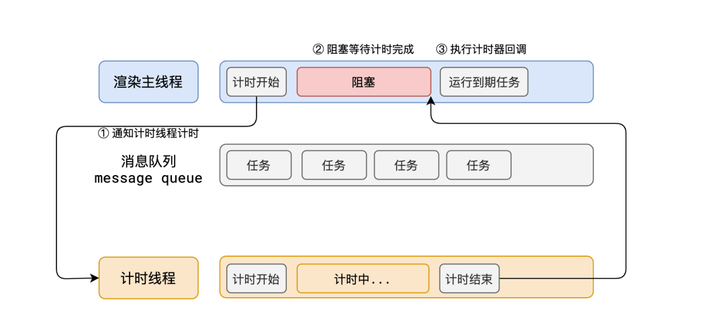
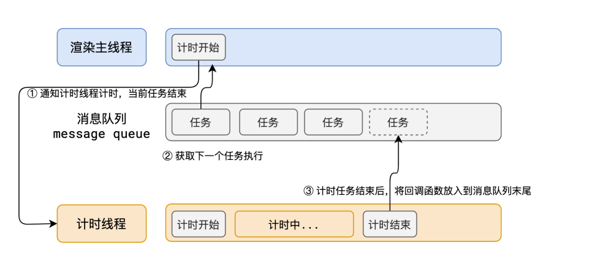

# 异步、事件循环、任务队列

### 异步函数的返回值

异步函数有返回值时，和普通函数会有区别：

- 情况一：异步函数也可以有返回值，但是异步函数的返回值相当于被包裹到Promise.resolve中；
- 情况二：如果我们的异步函数的返回值是Promise，状态由会由Promise决定；
- 情况三：如果我们的异步函数的返回值是一个对象并且实现了thenable，那么会由对象的then方法来决定；

```jsx
async function foo() {
    //1.返回一个普通值
    // Promise.resolve(111)
    // return ["abc", "cde", "fgb"]

    //2.返回一个Promise
    // return new Promise((resolve, reject) => {
    //   setTimeout(() => {
    //     resolve("Hello World")
    //   }, 1000)
    // })

    //3.返回一个thenable函数
    return {
        then: function () {
            setTimeout(() => {
                console.log("你好")
            }, 2000)
        }
    }
}
foo().then(res => {
    console.log("res", res)
})
```

### 进程和线程

- **进程**（process）：计算机已经运行的程序，是操作系统管理程序的一种方式；
    - 每个应用至少有一个进程，进程之间相互独立，即使要通信，也需要双方的同意
- **线程**（thread）：操作系统能够运行运算调度的最小单位，通常情况下它被包含在进程中
    - ⼀个进程⾄少有⼀个线程，所以在进程开启后会⾃动创建⼀个线程来运⾏
    代码，该线程称之为主线程
    - 如果程序需要同时执⾏多块代码，主线程就会启动更多的线程来执⾏代
    码，所以⼀个进程中可以包含多个线程

### 浏览器有哪些进程和线程

- 浏览器是⼀个多进程多线程的应⽤程序
    - 浏览器内部⼯作极其复杂。
    - 为了避免相互影响，为了减少连环崩溃的⼏率，当启动浏览器后，它会⾃动启动多个进程。
- **浏览器最主要的进程**
    
    
    
    1. **浏览器进程**
        1. 主要负责界⾯显示(→、←、home、刷新等)、⽤户交互(鼠标、键盘的交互)、⼦进程管理()等。浏览器进程内部会启动多个线程处理不同的任务。
    2. **网络进程**
        1. 负责加载网络资源。网络进程会启动多个线程处理不同的网络任务
    3. **渲染进程(重点)**
        1. 渲染进程启动后，会开启⼀个**渲染主线程**，主线程负责执⾏ HTML、CSS、JS 代码。
        2. 默认情况下，浏览器会为每个标签⻚开启⼀个新的渲染进程，以保证不同的标签⻚之间不相互影响。

### 渲染进程是如何工作的？

- 浏览器中最繁忙的线程，需要处理的任务包括但不限于：
    - 解析HTML
    - 解析CSS
    - 计算样式
    - 布局
    - 处理图层
    - 每秒把页面画60次
    - 执行全局的JS代码
    - 执行事件处理函数
    - 执行计数器的回调函数
    - 为什么渲染进程不适用多个线程处理这些事情
- **如何调度任务**
    - 正在执行一个JS函数，执行到一半的时候用户点击按钮，该立即执行点击事件的函数吗
    - 正在执行一个JS函数，执行到一半时某个计数器到达了时间，该去执行回调吗

### 浏览器的事件循环



1. 在最开始的时候，渲染主线程会进⼊⼀个⽆限循环
2. 每⼀次循环会检查消息队列中是否有任务存在。如果有，就取出第⼀个任务执⾏，执⾏完⼀个后进⼊下⼀次循环；如果没有，则进⼊休眠状态
3. 其他所有线程（包括其他进程的线程）可以随时向消息队列添加任务。新任务会加到消息队列的末尾。在添加新任务时，如果主线程是休眠状态，则会将其唤醒以继续循环拿取任务

### 何为异步(面试题)

- JS是⼀⻔单线程的语⾔，这是因为它运⾏在浏览器的渲染主线程中，⽽渲染
主线程只有⼀个。
- ⽽渲染主线程承担着诸多的⼯作，渲染⻚⾯、执⾏ JS 都在其中运⾏。
如果使⽤同步的⽅式，就极有可能导致主线程产⽣阻塞，从⽽导致消息队列
中的很多其他任务⽆法得到执⾏。这样⼀来，⼀⽅⾯会导致繁忙的主线程⽩
⽩的消耗时间，另⼀⽅⾯导致⻚⾯⽆法及时更新，给⽤户造成卡死现象。
- 所以浏览器采⽤异步的⽅式来避免。具体做法是当某些任务发⽣时，⽐如计
时器、⽹络、事件监听，主线程将任务交给其他线程去处理，⾃身⽴即结束
任务的执⾏，转⽽执⾏后续代码。当其他线程完成时，将事先传递的回调函
数包装成任务，加⼊到消息队列的末尾排队，等待主线程调度执⾏。
在这种异步模式下，浏览器永不阻塞，从⽽最⼤限度的保证了单线程的流畅
运⾏



假设同步，线程处理方式



异步的线程示意

### 阐述一下js的事件循环队列(面试题)

- 事件循环⼜叫做消息循环，是浏览器渲染主线程的⼯作⽅式。官方叫Event Loop，浏览器内部叫message Loop，在 Chrome 的源码中，它开启⼀个不会结束的 for 循环，每次循环从消息队列中取出第⼀个任务执⾏，⽽其他线程只需要在合适的时候将任务加⼊到队列末尾即可。
- **过去把消息队列简单分为宏队列和微队列，这种说法⽬前已⽆法满⾜复杂的
浏览器环境，取⽽代之的是⼀种更加灵活多变的处理⽅式**。
- 根据 W3C 官⽅的解释，**每个任务有不同的类型，同类型的任务必须在同⼀个队列，不同的任务可以属于不同的队列**。不同任务队列有不同的优先级，在⼀次事件循环中，由浏览器⾃⾏决定取哪⼀个队列的任务。但浏览器必须有⼀个微队列，微队列的任务⼀定具有最⾼的优先级，必须优先调度执⾏。
- 目前Chorm中，至少实现了下面的队列(**新进新出**)
    - **延时队列**：用于存放计时器到达后的回调任务，优先级【中】，包括setTimeout、setInteval等
    - **交互队列**：用于存放用户操作后产生的事件处理任务，优先级【高】，包括DOM监听、UIRendering等
    - **微队列**：用户存放的最快需要执行的队列，优先级【最高】，包含Promise的then回调、Mutation Obersever API以及queueMicrotask()等

### JS中的计时器能做到精确计时吗？为什么？(面试题)

1. 计算机内部**没有原子钟**，无法做到精确计时
2. 操作系统的**计时函数本身就有少量偏差**，由于 **JS 的计时器最终调⽤的
是操作系统的函数，也就携带了这些偏差**
3. 按照 W3C 的标准，浏览器实现计时器时，**如果嵌套层级超过 5 层，
则会带有 4 毫秒的最少时间**，这样在计时时间少于 4 毫秒时⼜带来
了偏差
4. 受事件循环的影响，**计时器的回调函数只能在主线程空闲时运⾏**，因此
⼜带来了偏差

### 微任务和宏任务(W3C标准已去除宏队列概念)

- 宏任务队列（macrotask queue）：Ajax、setTimeout、setInterval、DOM监听、UI Rendering等
- 微任务队列（microtask queue）：Promise的then回调、 Mutation Observer API、queueMicrotask()等

### 面试题一

```jsx
setTimeout(function () {
  console.log("setTimeout1");
  new Promise(function (resolve) {
    resolve();
  }).then(function () {
    new Promise(function (resolve) {
      resolve();
    }).then(function () {
      console.log("then4");
    });
    console.log("then2");
  });
});

new Promise(function (resolve) {
  console.log("promise1");
  resolve();
}).then(function () {
  console.log("then1");
});

setTimeout(function () {
  console.log("setTimeout2");
});

console.log(2);

queueMicrotask(() => {
  console.log("queueMicrotask1")
});

new Promise(function (resolve) {
  resolve();
}).then(function () {
  console.log("then3");
});

// promise1
// 2
// then1
// queueMicrotask1
// then3
// setTimeout1
// then2
// then4
// setTimeout2

```

### 面试题二

```jsx
async function async1 () {
    console.log('async1 start')
    await async2();
    console.log('async1 end')
}

async function async2 () {
    console.log('async2')
}

console.log('script start')

setTimeout(function () {
    console.log('setTimeout')
}, 0)

async1();

new Promise (function (resolve) {
    console.log('promise1')
    resolve();
}).then (function () {
    console.log('promise2')
})

console.log('script end')

// script start
// async1 start
// async2
// promise1
// script end
// async1 end
// promise2
// setTimeout
```