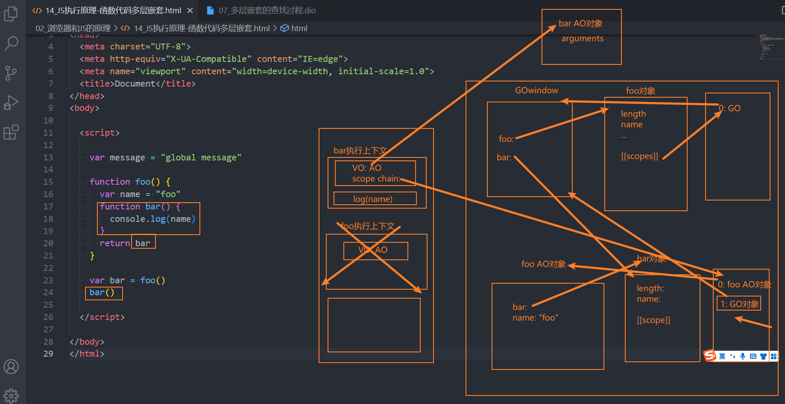
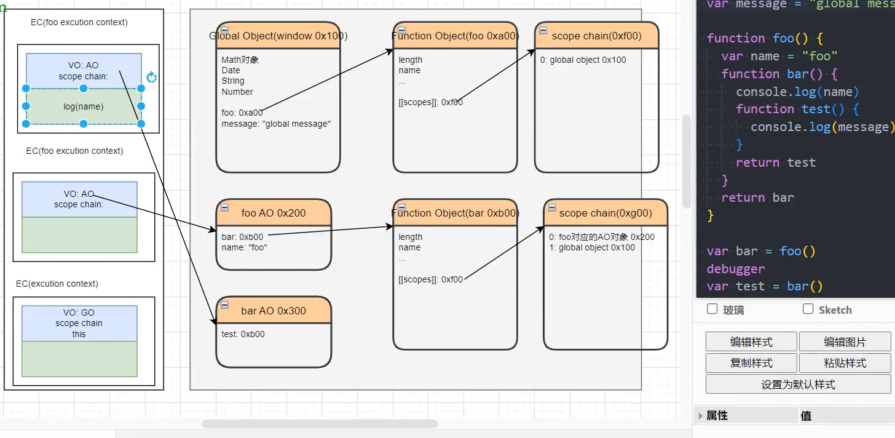
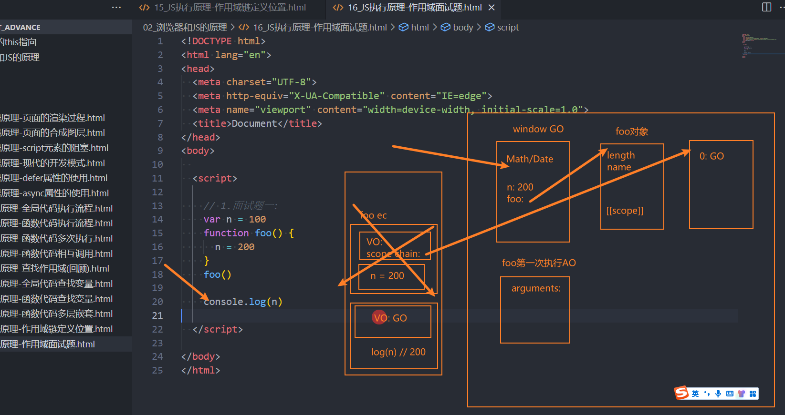
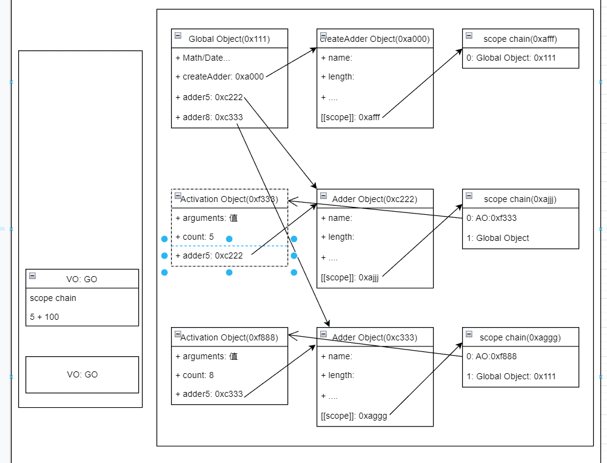

# 作用域链与闭包

### *执行上下文*

```jsx
var message = "Global Message"
function foo() {
var message = "Foo Message"
}
var num1 = 10
var num2 = 20
var result = num1 + num2
console.log(result)
```

### 初始化全局对象(Global Object)

- js引擎会在执行代码之前，会在**堆内存中创建一个全局对象**：Global Object（GO）
    1. 该对象 **所有的作用域（scope）**都可以访问
    2. 里面会包含**Date、Array、String、Number、setTimeout、setInterval**等等
    3. 其中还有一个**window属性**指向自己

### 执行上下文(Execution Context stack，简称ECS)

- 全局的代码块为了执行会构建一个 **Global Execution Context（GEC）**
- GEC会 **被放入到ECS中** 执行
- **GEC被放入到ECS中里面包含两部分内容**
    1. **第一部分：**在代码执行前，在parser转成AST的过程中，会将全局定义的变量、函数等加入到GlobalObject中，但是并不会赋值；这个过程也称之为变量的作用域提升（hoisting）
    2. **第二部分：**在代码执行中，对变量赋值，或者执行其他的函数

### VO对象(Variable Object)

- 每一个执行上下文关联一个VO(Variable Object，变量对象)，**变量和函数声明**会添加到这个VO对象中
- 当全局对象被执行的时候，VO对象就是GO对象
- 在执行的过程中**执行到一个函数时**，会根据**函数体创建一个函数执行上下文(Functional Execution Context，FEC)，压入到EC Stack中**
- **因为每个执行上下文都会关联一个VO，那么函数执行上下文关联的VO是什么呢？**
    1. 当进入一个函数执行上下文时，会创建一个AO对象（Activation Object）
    2. 这个AO对象**会使用arguments作为初始化**，并且**初始值是传入的参数**
    3. 这个AO对象会作为执行上下文的VO来存放变量的初始化

### 作用域和作用域链(scope chain)

函数被创建时作用域链就已经创建

```jsx
var message = "Global Message"

function foo() {
    var name = "foo"
    function bar() {
        console.log(name)
    }
    return bar
}
var bar = foo()
bar()
```





### 作用域面试题

```jsx
//一
console.log("第一题")
var n1 = 100
function foo1() {
    n1 = 200//访问了n1,n1被赋值了200
}
foo1()
console.log(n1)//200
console.log("**********")
```



```jsx
//二
console.log("第二题")
function foo2() {
    console.log(n2)
    var n2 = 200
    console.log(n2)
}
var n2 = 100
foo2()//undefined 200
console.log("**********")

//三
console.log("第三题")

var n3 = 100

function foo3() {
    console.log(n3)//100 后打印
}

function foo4() {
    var n3 = 200
    console.log(n3)//200 先打印
    foo3()
}
foo4()//200 100
console.log(n3)//100
console.log("**********")

//四
console.log("第四题")
var a1 = 100
function foo5() {
    console.log(a1)//找的是自己的a，此时a还未定义，故undefined
    return
    var a1 = 100//a仍然存在，因为还没有执行，return不作用
    }
foo5()//100 => undefined
console.log("**********")

//五
//开发中错误写法：
//message = "Hello World" 此时message当做全局变量解析

console.log("第五题")
function foo6() {
    var a2 = b = 100
    //相当于
    //var a2 = 100
    //b = 100 此时b定义在了全局变量中
    }
foo6()
console.log(a2)//Uncaught ReferenceError：a is not defined
console.log(b)//此时在全局变量中找到了 b = 100
console.log("**********")
```

### 为什么创建如此多的对象

目的是为了闭包(closure)

### summary

在全局执行上下文中，**Variable Object**即指向**Global Object**

在执行上下文中，**Variable Object**即指向**Activation Object**

### *内存管理和闭包*

### 认识内存管理

### 内存管理的生命周期

- 第一步：**分配申请你需要的内存**（申请）
- 第二步：**使用分配的内存**（存放一些东西，比如对象等）
- 第三步：**不需要使用时，对其进行释放**

### 不同的语言对于内存管理的不同

- 手动管理内存：比如C、C++，包括早期的OC，都是需要手动来管理内存的申请和释放的（malloc和free函数）
- 自动管理内存：比如Java、JavaScript、Python、Swift、Dart等，它们有自动帮助我们管理内存

### JavaScript的内存管理是无形的

- 我们创建的**原始值、对象、函数……这一切都会占用内存**
- 并**不需要手动来对它们进行管理**，**JavaScript引擎**会帮助我们处理好它

### JavaScript的内存管理

- **原始数据类型：直接在栈空间内分配**
- **复杂数据类型：在堆空间内分配，将这块空间的指针**返回变量引用

### JavaScript的垃圾回收机制

- Garbage Collection，简称GC

### JavaScript的垃圾回收机制算法

- **引用计数**(Reference Counting)
    1. 当**一个对象有一个引用指向它**时，那么这个对象的**引用就+1**
    2. 当一个**对象的引用为0时，这个对象就可以被销毁掉**
    3. 弊端
    
    **产生循环引用**
    
- **标记清除**(mark Sweep)
    1. 标记清除的核心思路是可达性（Reachability）
1. 这个算法是设置一个根对象（root object），垃圾回收器会定期从这个根开始，找所有从根开始有引用到的对象，对于哪些没有引用到的对象，就认为是不可用的对象；
2. 解决引用循环的问题
- 全局对象的几种叫法
    1. 执行上下文：Global Object
    2. 堆中：称之为Activation Object
    3. 在GC中：称之为Root Object
    4. 平时使用中：window
- **标记整理**(Mark-Compact)
    1. ，回收期间同时会将保留的存储对象**搬运汇集到连续的内存空间**，从而**整合空闲空间，避免内存碎片化**
- **分代收集(**Generational collection***)
    1. 对象被分成两组：**“新的”和“旧的”**
    2. 许多对象出现，完成它们的工作并很快死去，它们可以**很快被清理**
    3. 那些长期存活的对象会变得“老旧”，而且被**检查的频次也会减少**
- **增量收集（***Incremental collection**）
    1. 如果有许多对象，并且我们**试图一次遍历并标记整个对象集，则可能需要一些时间，并在执行过程中带来明显的延迟**
    2. 所以**引擎试图将垃圾收集工作分成几部分来做**，然后**将这几部分会逐一进行处理，这样会有许多微小的延迟而不是一个大的延迟**
- **闲时收集（***Idle-time collection）**
    1. 垃圾收集器只会**在 CPU 空闲时尝试运行**，以减少可能对代码执行的影响

### 闭包

- **广义的角度：创建一个函数的时候闭包就产生了**
- **狭义的角度：创建一个函数，能够访问外部的变量**，即闭包产生

```jsx
function createAdder(count) {
    function adder(num) {
        return num + count
    }
    return adder
}

var adder5 = createAdder(5)
console.log(adder5(200))
console.log(adder5(100))

//柯里化
var adder8 = createAdder(8)
console.log(adder8(100))
console.log(adder8(200))
```

